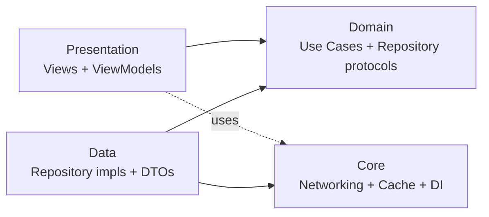
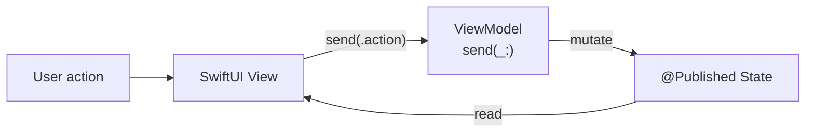
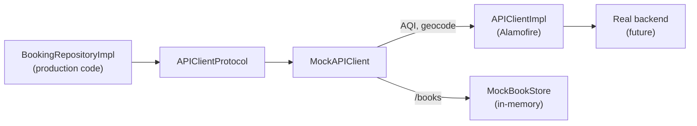

# TadaMVL

iOS take-home for the Tada senior-iOS interview. SwiftUI + MapKit + Alamofire,
Clean Architecture, manual DI, unidirectional data flow, and a transparent
mock backend for `/books`.

## Setup

Requirements: **Xcode 16+**, iOS 16 deployment target, CocoaPods.

```bash
pod install
open TadaMVL.xcworkspace   # NOT the .xcodeproj
```

Build & run on any iOS 16+ simulator or device.

### API keys

The WAQI air-quality token is read from `Info.plist` at runtime (key
`AQI_TOKEN`) with a baked-in default so the project runs out of the box.
To use your own token, swap the value of `AQI_TOKEN` in
`TadaMVL/Info.plist`.

BigDataCloud's free reverse-geocode endpoint requires no key.

## Architecture

Clean Architecture, four layers, dependency arrows pointing inward:



- **Presentation** (`TadaMVL/Presentation/...`) — SwiftUI views with strict UDF
  view models (`@Published private(set) var state: State` + `enum Action` +
  `func send(_:)`). Views read state; writes go through `send`.
- **Domain** (`TadaMVL/Domain/...`) — pure Swift. Use cases
  (`FetchAQIUseCase`, `ReverseGeocodeUseCase`, `CreateBookUseCase`,
  `FetchBooksUseCase`) and repository protocols. No Alamofire / SwiftUI here.
- **Data** (`TadaMVL/Data/...`) — implementations of the domain repository
  protocols, wire-format DTOs, `LocationCache`, mock layer.
- **Core** (`TadaMVL/Core/...`) — `APIClient` (Alamofire), `AppContainer`
  (manual DI), `DesignTokens`, `LocationManager`, extensions.

### Dependency wiring

Manual DI through `AppContainer` (`TadaMVL/Core/DI/AppContainer.swift`). All
collaborators are passed via constructors. No third-party DI library — the
graph stays small and reviewable.

### Unidirectional data flow



Every view-model method that mutates state is funneled through `send(_:)`.
Two-way bindings (e.g., the `MKMapView` region) are exposed as computed
`Binding` proxies that translate writes into `send(_:)` calls.

## The 5 screens

| # | Screen | Notes |
|---|---|---|
| 1 | Map | Full-screen MapKit, centered black teardrop pin, top-right AQI badge updated on pan (debounced ~350 ms), A/B rows + square yellow V button (cycles `Set A` / `Set B` / `Book`). |
| 2 | Location Detail | Slot header (A/B + name), aqi row, filled nickname text field (≤20 chars), full-width yellow `Save` button. |
| 3 | Booking | Two flat sections (A/B header + aqi + nickname), price footer row, full-width yellow `Book` button → pushes History. |
| 4 | History | Stacked `Total Count` / `Total Price` summary, hairline-separated list rows showing A name then B name. Tap → pops back to Map with A+B prefilled, V=Book, AQI re-fetched. |
| 5 | Cached Locations | Sheet opened when an unset A/B row is tapped on Map. Clean list, bold letter avatar + display name. Empty state when cache is dry. |

## Caching by coordinate

`LocationCache` (`TadaMVL/Data/Cache/LocationCache.swift`) keys entries by
latitude / longitude rounded to **3 decimal places** (`Double.roundedTo3()`).
Per the brief:

- `(37.5642, 127.0016)` and `(37.5645, 127.0018)` → same cache key.
- `(37.5655, 127.2321)` and `(37.5624, 127.2328)` → distinct keys.

`LocationRepositoryImpl` consults the cache *before* every reverse-geocode
network call and writes the result back, so two coordinates that round to
the same 3-decimal key share a single network round-trip.

The cache exposes two views over the same coordinate space:
- `addressCache` — every reverse-geocode lookup.
- `pointCache` — richer `LocationPoint` snapshots captured at Set-A / Set-B
  time. Powers the 5th screen list.

## Mock backend

The brief requires that the mock not affect business logic. Architecture:



- `BookingRepositoryImpl` is real production code that calls
  `APIClientProtocol` against `/books`.
- `MockAPIClient` is the default client wired in `AppContainer`. It
  intercepts URLs containing `/books` (`POST` → insert into `MockBookStore`
  with id + price 10_000; `GET` → filter by year/month) and forwards
  everything else to a real `APIClientImpl` (Alamofire) — so WAQI and
  BigDataCloud requests still hit the real internet.

### Mock toggle

```
DISABLE_MOCK_BOOKS=1
```

Set as an environment variable in your scheme (Edit Scheme → Run →
Arguments → Environment Variables) to remove the interceptor and talk to a
real backend if one is wired up.

## Tests

```
xcodebuild test \
  -workspace TadaMVL.xcworkspace \
  -scheme TadaMVL \
  -destination 'platform=iOS Simulator,name=iPhone 15'
```

Test coverage focuses on the spec-critical bits:

- `LocationCacheTests` — the 3-decimal equivalence rule (exact examples
  from the brief).
- `ReverseGeocodeUseCaseTests` — top-2 highest-`order` admin name
  concatenation.
- `FetchAQIUseCaseTests` — repository pass-through.
- `MockAPIClientTests` — POST `/books` round-trip (echo + price + id) and
  GET filtering by year/month.
- `MapViewModelTests` — `.assignA` → button title `Set B`; `.assignA` +
  `.assignB` → `Book`; `.restore(book)` → both slots filled and an AQI
  fetch dispatched.

## Project layout

```
TadaMVL/
├── App/
│   ├── TadaMVLApp.swift         # @main, root container injection, light-mode lock
│   └── AppRouterView.swift      # Composes MapScreen at the root
├── Core/
│   ├── DI/AppContainer.swift    # Composition root
│   ├── Design/DesignTokens.swift
│   ├── Network/                 # APIClient + APIConstants
│   ├── Utils/LocationManager.swift
│   └── Extensions/
├── Data/
│   ├── Cache/LocationCache.swift
│   ├── Mock/                    # MockAPIClient + MockBookStore
│   ├── Repositories/            # Real repo impls
│   └── Services/                # AQI + Geocode HTTP services
├── Domain/
│   ├── Models/                  # LocationPoint, Book, response DTOs
│   ├── Repositories/            # protocols
│   └── UseCases/
└── Presentation/
    ├── Components/              # PrimaryButton, LabelValueRow, SlotHeader, ErrorBanner
    └── Screens/                 # Map / Booking / History / Cached / LocationDetail
```

## Decisions worth flagging

- **MVVM, not TCA.** The brief allows either; manual MVVM with the
  `State + Action + send` shape provides the same UDF discipline with a
  smaller dependency surface.
- **MapKit, not Google Maps.** The brief explicitly allows MapKit when
  using SwiftUI. UIKit-backed `MKMapView` (`MKMapContainerView`) was chosen
  over SwiftUI's `Map` because `regionDidChangeAnimated` reliably reports
  pan/zoom for driving the debounced AQI fetch.
- **No DI library.** Constructor-based DI through `AppContainer` is enough
  for this size of project and keeps the dependency graph trivial to read.
- **No client-side persistence of bookings.** The mock is in-memory by
  design; restarting the app clears `MockBookStore`. `LocationCache` does
  persist to `UserDefaults` because the brief requires its results to
  outlive a single session.
